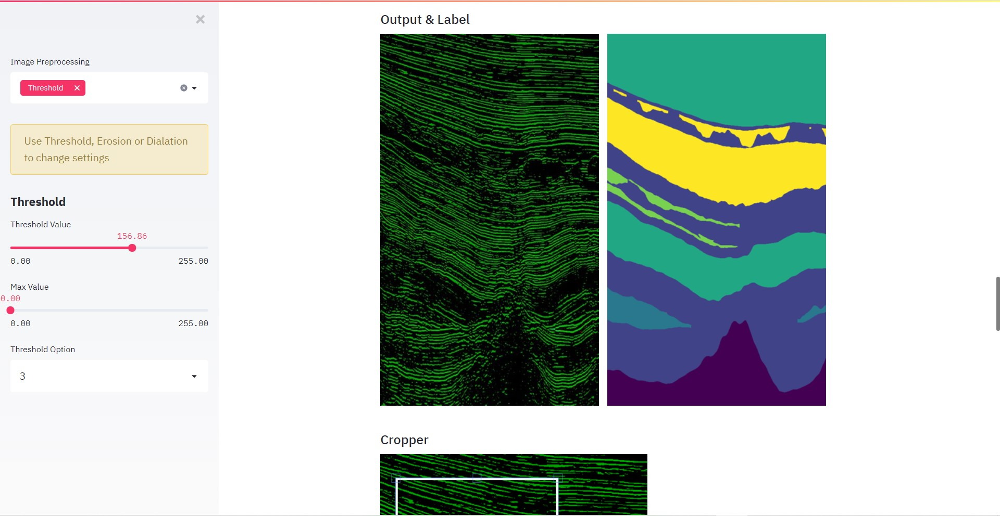

# Seismic Facies Identification 🌋

This Github repo is based on the AICrowd Facies Identification Challenge in which we need to create a ML/DL Model to do pixel classification by taking 3D images.

# Table of Contents

* [Motivation](#Motivation)
* [The Notebook](#The-Notebook)
* [The Application](#the-application)
* [About](#about)
  * [Tools Used](#tools-used)
  * [Dataset](#dataset)
  * [Evaluation](#evaluation)
* [Getting Started](#getting-started)
  * [Prerequisites](#Prerequisites)
  * [Installation](#Installation)
* [Usage](#Usage)
* [License](#license)
* [Contact](#contact)

# Motivation

My main motivation to work on this project is that it was 3D image dataset rather than 2D image dataset. And yes, I actually make this a 2D problem because 3D convolutions are very inefficient & computationally expeensive. 

In my last project which was [Water Segmentation 🌊](https://github.com/Shubhamai/water-segmentation), i used FastAI to build UNet to classifty pixel based on water/no water. But this is muli class pixel classification where there is total of **6 pixel labels**. And instead of making UNet in fastai, i used Tensorflow 2.0 & Keras to make UNet from scratch, ( mainly because of wating to get a bit more experience on how UNet works ). 

# The Notebook

The `🌎 Seismic Facies Identification Challange.ipynb` contains everything from Data Exploration to submitting the predictions. 
Also you can find the google colab notebook here - https://colab.research.google.com/drive/1t1hF_Vs4xIyLGMw_B9l1G6qzLBxLB5eG?usp=sharing

Here are the tabels on content - 

> 1. Setting our Workspace :briefcase:
> 2. Data Exploration :face_with_monocle:
> 3. Image Preprocessing Techniqes :broom:
> 4. Creating our Dataset :hammer:
> 5. Creating our Model :factory:
> 6. Training the Model :steam_locomotive:
> 7. Evaluating the model :test_tube:
> 8. Testing on test Data :100:
> 9. Generate More Data + Some tips & tricks :bulb:

# The Application

I also made an Application using Streamlit which contains the Data Visualisation ( Interactive ) and Image Preprocessing ( Interactive, you can change every settings ). 

The Application is also deployed on Heroku!, check this out! https://seismic-facies-identification.herokuapp.com/

# About

## Tools Used 
- [Tensorflow 2.0](http://tensorflow.org/)
- [Streamlit](https://streamlit.io/)
- [Plotly](http://plotly.com/python/)
- [CV2](https://opencv.org/), [pandas](https://pandas.pydata.org/), [numpy](https://numpy.org/) and much more...

## [Dataset](https://www.aicrowd.com/challenges/seismic-facies-identification-challenge#dataset)

We have 3D dataset both ( features X, and labels Y ) with **shape for X is 1006 × 782 × 590**, in axis corresponding **Z, X, Y** and Y in 1006 × 782 × 590 in also axis corresponsing Z, X, Y.

We can say that we have total of **2,378 2D trainig images** with their corresponsing labels and we also have same number of **2,378 2D testing images** which we will predict labels for.

## Evaluation
The evaluation metrics are the F1 score and accuracy.

# Getting Started

Below are the steps to run the application in your PC or laptop, whatever. 

##  Prerequisites

- Python 3.x - You can download python in [Official Python Site](https://www.python.org/).   

## Installation

### Through Github 

1. Clone the repo using `git clone https://github.com/Shubhamai/seismic-facies-identification.git`
2. Run `pip install -r requirements.txt`
3. Run `jupyter notebook` and open `🌎_Seismic_Facies_Identification_Challange.ipynb`
                           OR
3. Run the streamlit application using `streamlit run ./app/app.py`                           
4. Enjoy 🎊

# License 
Distributed under the GNU General Public License v3.0. See `LICENSE` for more information.
